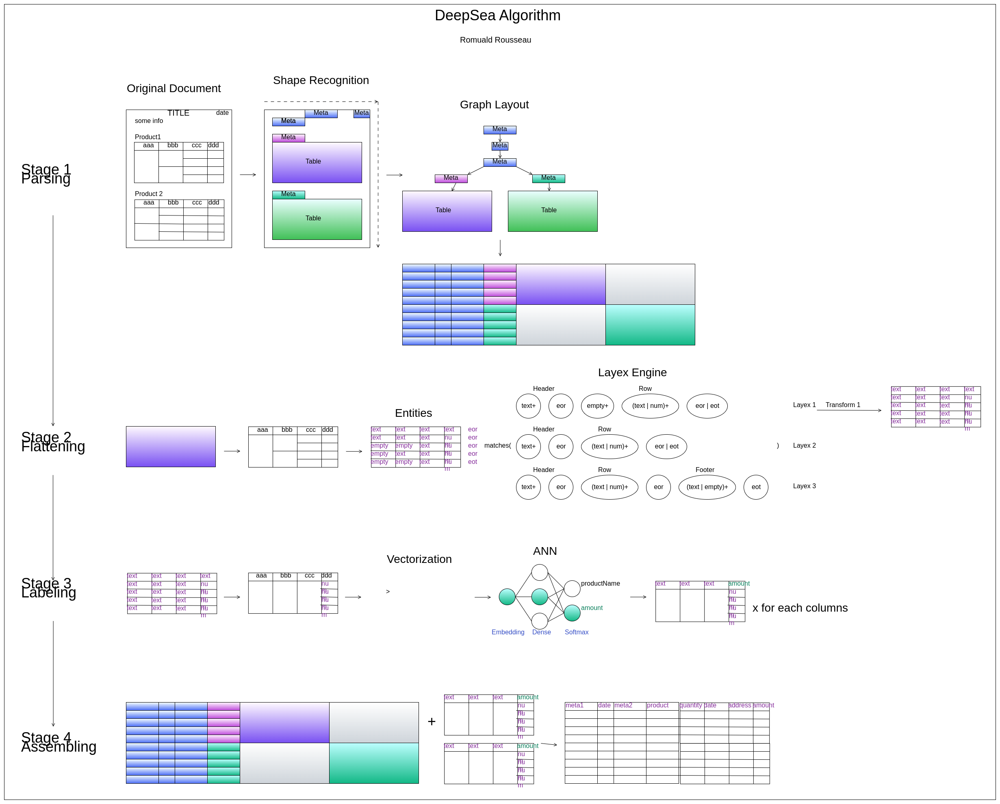

# Revolutionizing Data Management: The Transformative Potential of a Novel Framework for Semi-Structured Documents

This document describes how Any2Json framework helps to manipulate semi-structured documents.

In today's data-driven landscape, navigating the complexities of semi-structured documents poses a significant challenge
for organizations. These documents, characterized by diverse formats and a lack of standardization, often require
specialized skills for effective manipulation and analysis. However, we propose a novel framework to address this
challenge. By leveraging innovative algorithms and machine learning techniques, this framework offers a solution that
transcends manual coding, providing enhanced accessibility to users across diverse skill levels. Moreover, by automating
the extraction process, it not only saves time but also minimizes errors, particularly beneficial for industries dealing
with large volumes of such documents. Crucially, this framework integrates seamlessly with machine learning workflows,
unlocking new possibilities for data enrichment and predictive modeling. Aligned with the paradigm of data as a service,
it offers a scalable and efficient means of managing semi-structured data, thereby expanding the toolkit of data services
available to organizations. This document highlights the transformative potential of the framework, paving the way for
organizations to harness valuable insights from previously untapped sources and drive innovation in data management and
analysis.

## Definitions and examples

Semi-structured documents have the characteristic of containing some type of information known a priori, but which can 
change the position and format within the document itself. In addition, semi-structured documents also vary a lot in
terms of layout and design. Some documents have a fixed set of data but no fixed format for this data. In some documents,
the date appears on the top right corner, in another variation, it is at the center of the document, and in yet another,
you’ll find it in the bottom left corner. Another added complication is that the same data is qualified by different
names. In one variation, a field may be called ‘Purchase Order Number’, in another - ‘PO Number’, and a few others may
call it “PO #”, “PO No.” or “Order Number’. These variations are endless and because of these two challenges, you cannot
use a template-based solution for these documents.

Examples

1. Examples of semi-structured document include emails, XML files, JSON files, social media posts, and log files. These
    types of data contain both structured and unstructured information, such as a mixture of predefined fields & free-form
    text.
2. Another classic example is the myriad of Excel files found within companies holding often precious information.

## What is the problems we are trying to fix?

Semi-structured documents are usually noisy and their layout changes over time. They contain defects, usually invisible
by the end user who read the document but provide a challenge to any automated process. They, also, contain tabular data
but may be completed by unstructured text around. For examples, the date of the document or a product may be in the
title and not in the tabular representation; simply extracting the table will miss some implicit information. These
specifies stop today tool to consistently load such documents.

The first consequence is a high running cost due to maintaining the pipeline of extraction every time the layout changed,
due to the custom code required that need to be modified all the time.

The second consequence is the difficulty to have a self-service to extract the data because Extract Load tools require
often engineering skills (even for no/low code solution on the long run).

## The solution; a framework to manipulate semi-structured document and transform them into consistent tabular output

**Addressing Data Complexity:** Semi-structured documents present a significant challenge due to their varied formats
and lack of standardization. By developing algorithms and employing machine learning techniques, our framework can
effectively handle this complexity without relying on manual coding.

**Enhanced Accessibility:** Traditional solutions for working with semi-structured documents often require skilled
engineers or developers. Our framework, however, eliminates this barrier by providing a user-friendly interface that
doesn't require coding expertise. This makes it more accessible to a wider range of users within organizations.

**Increased Efficiency:** Automating the process of extracting data from semi-structured documents not only saves time
but also reduces the likelihood of errors that can occur with manual intervention. This efficiency gains can be
particularly valuable in industries where large volumes of such documents need to be processed regularly.

**Integration with Machine Learning:** By incorporating machine learning capabilities into the framework, you're not
only extracting data but also enriching it with insights derived from advanced analytics. This opens up new
possibilities for leveraging semi-structured data in machine learning workflows, enhancing decision-making and
predictive modeling. 

**Expansion of Data as a Service:** Our framework aligns with the concept of data as a service by providing a scalable
and efficient means of managing semi-structured data. This expands the toolbox of data services available to
organizations, enabling them to harness valuable insights from previously untapped sources.

## A global overview of the framework

The framework is actually written in Java and use several frameworks such as Tensorflow, Jython, etc … The framework
loads and parses the document through different steps to extract and structure the data. 

The basic steps are:

### Load by Chunks

The framework is able to load various format such as Excel, CSV, PDF, HTML … A plugin system allows to add new loader
easily. Loaders stage the data into lists of chunks to allow processing of huge amount of data and minimize memory
footprint between steps.

### Noise reduction

Noise reduction consist to remove defects or visual artifacts such as:

* Empty cells used as row or column separator
* Empty cells inserted wrongly due to manual manipulations
* Merged cells
* …

The noise reduction must be resilient to layout changes so simple removal of the nth column or row is not allowed. The
framework includes the possibility to do small transformations using recipes. A recipe is a small Jython script that can
access to the document model and manipulate it and perform basic cleansing.

### Feature Extraction

Feature extraction will parse the cleaned document, detect tables and other meta data. It will build a tree of the
different features of the document linked by their relation of importance.

The relation of importance is based on the proximity of the elements to each other based on their reading direction. The
human eye reads a document using a certain direction; from top to bottom and left to right for English or right to left
depending in Arab. As such, when a human creates a document, he is influenced by this reading direction because he
supposes his future reader to look at the document with a certain way. It means the various elements of the document 
will follow the reading direction and therefore can be linked to each other along this direction. You can find the
detailed explanation in the white paper [Semi-structured document feature extraction]().

### Table Layout Parsing

Feature extraction is not enough to structured the document, each table needs a deep analysis. The framework allows to
parse the table to detect headers, sub headers, sub footers, footers, pivoted columns … A plugin system allows to add
new parser into the framework.

We will study an original approach to detect and extract the different parts of a table using a pattern matching
algorithm similar to regular expressions. You can find the detailed explanation in the white paper
[Table Layout Regular Expression]().

### Tabular Assembling

This step will take all structures generated above and merge them into a single tabular structure. This structure is
very easy to store in a database or a flat file such as parquet. You can find the detailed explanation in the white paper
[Semi-structured document feature extraction]() as we join a general algorithm to transform a semi-structured document
to a tabular output.

### Tagging

The last step will annotate each column of the tabular output a tag. Again a plugin system allows to add new tagger.
This tag can be used as the name of the column when storing in a database.

We will present in a tagger based on word embedding and a neural network to classify each data with an unique tag.

## Detailed Algorithm

All these steps are summarized in the graph below:

## Conclusion

Subsequent articles will be an in depth description of each steps of this framework and how to use it. All source codes
are available on our [github](https://github.com/RomualdRousseau/Any2Json).