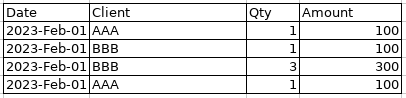

# Tutorial 1 - Getting Started

[View source on GitHub](https://github.com/RomualdRousseau/Archery-Examples).

This short introduction uses [Archery](https://github.com/RomualdRousseau/Archery) to:

1. Load simple tabular documents in CSV and Exce formats.
2. Display the tabular result on the console.

The expected layout of each document is a single header row followed by rows of cells:



## Setup Archery

### Import the packages and setup the main class:

```java
package com.github.romualdrousseau.archery.examples;

import java.util.EnumSet;
import java.util.List;

import com.github.romualdrousseau.archery.Document;
import com.github.romualdrousseau.archery.DocumentFactory;
import com.github.romualdrousseau.archery.parser.LayexTableParser;

public class Tutorial1 implements Runnable {

    public Tutorial1() {
    }

    @Override
    public void run() {
        // Code will come here
    }

    public static void main(final String[] args) {
        new Tutorial1().run();
    }
}
```

### pom.xml

Archery has a very modular design. Each module has to be loaded explicitely. The following modules are
required to run the code of this tutorial:

```xml
<!-- Archery Framework -->
<dependency>
    <groupId>com.github.romualdrousseau</groupId>
    <artifactId>archery</artifactId>
    <version>${archery.version}</version>
</dependency>
<dependency>
    <groupId>com.github.romualdrousseau</groupId>
    <artifactId>archery-csv</artifactId>
    <version>${archery.version}</version>
</dependency>
<dependency>
    <groupId>com.github.romualdrousseau</groupId>
    <artifactId>archery-excel</artifactId>
    <version>${archery.version}</version>
</dependency>
```

## Minimal code

The minimal code to load a document is as follow:

```java
final var file = Common.loadData(f, this.getClass());
try (final var doc = DocumentFactory.createInstance(file, "UTF-8")) {
    doc.sheets().forEach(s -> s.getTable().ifPresent(t -> {
        doSomethingWithHeaders(t.headers());
        doSomethingWithRows(t.rows());
    }));
}
```

The encoding ("UTF-8" here) is used if the encoding could not be detected when loading the document.

### Iterate overs the headers:

```java
headers.forEach(h -> {
    // Do something with the header
});
```

### Iterate over the rows and cells:

```java
rows.forEach(r -> {
    r.cells().forEach(c -> {
        // Do something with the cell
    });
});
```

## Load several file formats

Here is a complete example to load and print the content of different CSV and Excel files:

```java
package com.github.romualdrousseau.archery.examples;

import java.util.List;

import com.github.romualdrousseau.archery.DocumentFactory;

public class Tutorial1 implements Runnable {

    private static List<String> FILES = List.of(
            "document with simple table.csv",
            "document with simple table.xls",
            "document with simple table.xlsx");

    public Tutorial1() {
    }

    @Override
    public void run() {
        FILES.forEach(f -> {
            final var file = Common.loadData(f, this.getClass());
            try (final var doc = DocumentFactory.createInstance(file, "UTF-8")) {
                doc.sheets().forEach(s -> s.getTable().ifPresent(t -> {
                    Common.printHeaders(t.headers());
                    Common.printRows(t.rows());
                }));
            }
        });
    }

    public static void main(final String[] args) {
        new Tutorial1().run();
    }
}
```

```bash
2024-03-09 18:40:23 INFO  Common:37 - Loaded resource: /data/document with simple table.csv
            Date                  Client                     Qty                  Amount
      2023/02/01                     AAA                       1                     100
      2023/02/01                     BBB                       1                     100
      2023/02/01                     BBB                       3                     300
      2023/02/01                     AAA                       1                     100
2024-03-09 18:40:24 INFO  Common:37 - Loaded resource: /data/document with simple table.xls
            Date                  Client                     Qty                  Amount                        
      2023-02-01                     AAA                       1                     100                        
      2023-02-01                     BBB                       1                     100                        
      2023-02-01                     BBB                       3                     300                        
      2023-02-01                     AAA                       1                     100                        
2024-03-09 18:40:24 INFO  Common:37 - Loaded resource: /data/document with simple table.xlsx
            Date                  Client                     Qty                  Amount
      2023-02-01                     AAA                       1                     100
      2023-02-01                     BBB                       1                     100
      2023-02-01                     BBB                       3                     300
      2023-02-01                     AAA                       1                     100
```

## Conclusion

Congratulations! You have loaded documents using Archery.

For more examples of using Archery, check out the [tutorials](index.md).
